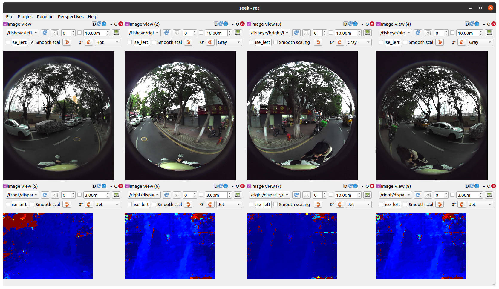
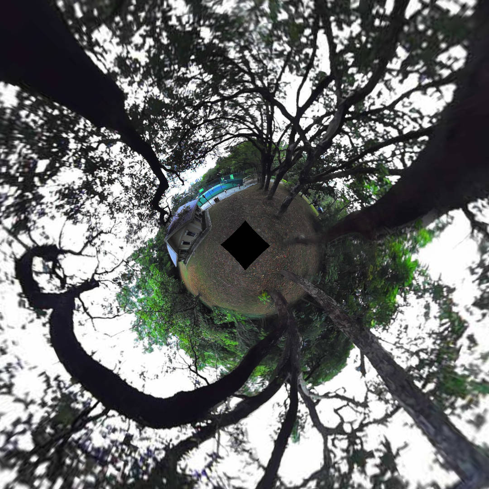
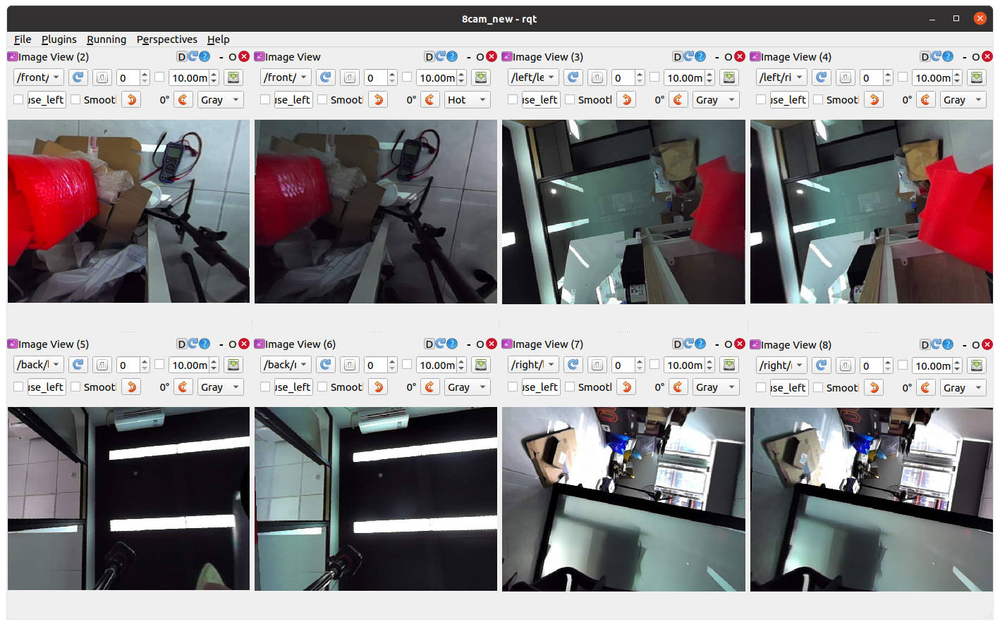

## 售后支持请添加微信

微信号：ShiYuan_Seeker

需要技术支持麻烦添加下客服微信，淘宝等平台不允许提供第三方联系方式，请不要再淘宝问技术支持相关问题，一律不回也不做任何技术支持

  


深圳市视元智能科技有限公司 seeker系列产品ROS SDK

为Seeker系列摄像头设计的开发套件，支持ROS1 Noetic环境下的多模态数据获取与处理。

## 📦 安装指南

### 环境要求

+ **Ubuntu 20.04**
+ **ROS Noetic** ([安装教程](http://wiki.ros.org/noetic/Installation/Ubuntu))
+ sudo apt install libusb-1.0-0-dev
+ pip3 install pyusb numpy ruamel.yaml

### 安装步骤

1. **创建工作空间**：

mkdir -p ~/catkin_ws/src

2. **克隆项目仓库**：

cd ~/catkin_ws/src && git clone http://gitee.com/nochain/seeker1.git

增加视差转深度图代码

git clone [https://github.com/skohlbr/disparity_image_proc.git](https://github.com/skohlbr/disparity_image_proc.git)

3. **编译项目**：

catkin_make -DCMAKE_BUILD_TYPE=Release

4. **设置环境变量**

source ~/catkin_ws/devel/setup.bash

或者：echo "source ~/catkin_ws/devel/setup.bash" >> ~/.bashrc

5. **安装解畸变包**

dpkg -i  ~/catkin_ws/src/seeker1/deb/ros-noetic-image-undistort_0.0.0-0focal_amd64.deb

## 🔌 硬件连接

1. 使用USB3.0 Type-C线连接设备
2. 设置设备权限 sudo vim /etc/udev/rules.d/99-seeker.rules，增加udev规则

```plain
SUBSYSTEM=="usb", ATTR{idVendor}=="2207", ATTR{idProduct}=="0000", MODE="0666"
```

‌**重新加载udev规则**‌

```bash
sudo udevadm control --reload && sudo udevadm trigger
```

**然后拔插一下设备**

## 🚀 快速开始

基础数据流（鱼眼图像+IMU+视差图）

```bash
roslaunch seeker 1seeker_nodelet.launch
```

## 其他例程运行前准备：（标定参数读取）

确保模块可以正常使用，usb访问没有权限问题，执行以下命令，从模块读取标定参数并生成配置文件：

```bash
python3 ~/catkin_ws/src/seeker/scripts/1get_kalibr_info.py
```

+ ‌**输出文件路径**：生成的标定参数文件默认保存至`/tmp/kalibr_cam_chain.yaml`

### 3.3.3. 配置文件部署‌

将生成的标定文件复制到目标配置目录：

```plain
cp /tmp/kalibr_cam_chain.yaml ~/catkin_ws/src/seeker/config/seeker_omni_depth/
```

+ ‌**依赖关系**：后续拼接、解畸变等流程需基于此文件进行参数初始化‌。

## 📂 Launch文件说明

### 图像查看

```bash
# 启动基础数据流（鱼眼图像 + 视差图 + IMU）
roslaunch seeker 1seeker_nodelet.launch  
```

**rqt_gui 导入**

rosrun rqt_gui rqt_gui然后在perspectives里面点击import一个一个导入 ~/catkin_ws/src/seeker/gui的全部gui文件。然后perspectives选择seeker。查看原始图像和视差图。



### 全景拼接

**运行**

```plain
roslaunch seeker 2concat_nodelet.launch concat_method:=3
注意，开启后需要隔一会（几秒钟）才会出图
话题为 /concat_undistort_node/image
可以用rqt_image_view进行查看
```

**效果**

concat_method:=0

简单拼接的360全景图


concat_method:=1 融合拼接BEV图

(blend_weight) 融合权重值，调整范围(从0.7调到0）(bev_ground_height)地面相对于模块的高度，例如(-1.0米)设置为(-1.0)(bev_fx) 虚拟摄像头焦距


concat_method:=2融合拼接360全景图

 

(blend_weight) 融合权重值，调整范围(从0.7调到0）(pano_radius) 半径大小

concat_method:=3融合拼接720全景图

 

(blend_weight) 融合权重值，调整范围(从0.7调到0）(pano_radius) 半径大小


### 图像解畸变

**运行**

```bash
roslaunch seeker 3undistort_nodelet.launch
```

**rqt_gui查看**

rosrun rqt_gui rqt_gui然后perspectives选择undistort。查看解畸变后的图。

**效果**

### 深度图

```plain
roslaunch seeker 4depth_image.launch
```

然后可以查看下面四个话题：

| /front/depth/image_raw |
| --- |
| /right/depth/image_raw |
| /back/depth/image_raw |
| /left/depth/image_raw |


### 点云

```plain
roslaunch seeker 5point_cloud.launch
```

用rviz进行查看：

若要查看话题/front/points2，Fixed Frame调整为/depth0

若要查看话题/right/points2，Fixed Frame调整为/depth1

若要查看话题/back/points2，Fixed Frame调整为/depth2

若要查看话题/left/points2，Fixed Frame调整为/depth3


> _@深圳市视元智能科技有限公司_
>

## 售后支持请添加微信

微信号：ShiYuan_Seeker

